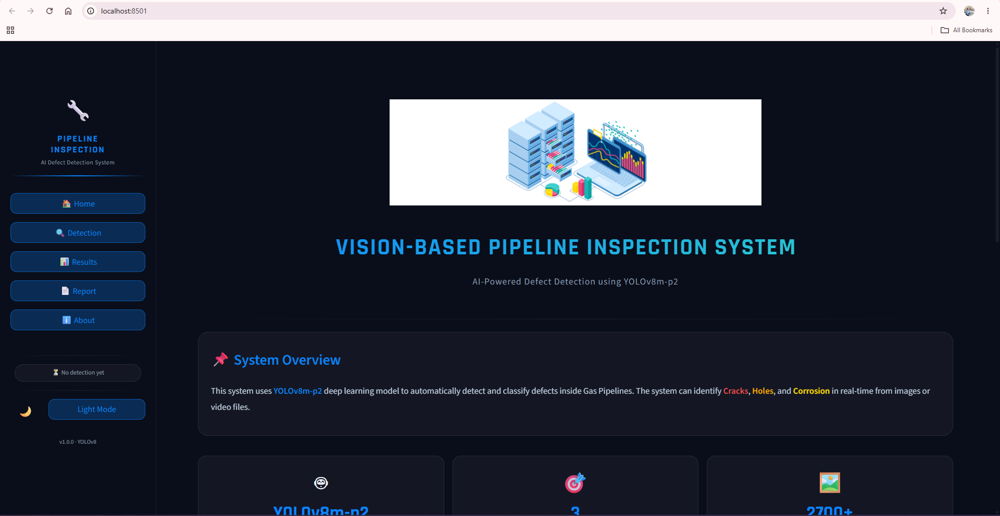
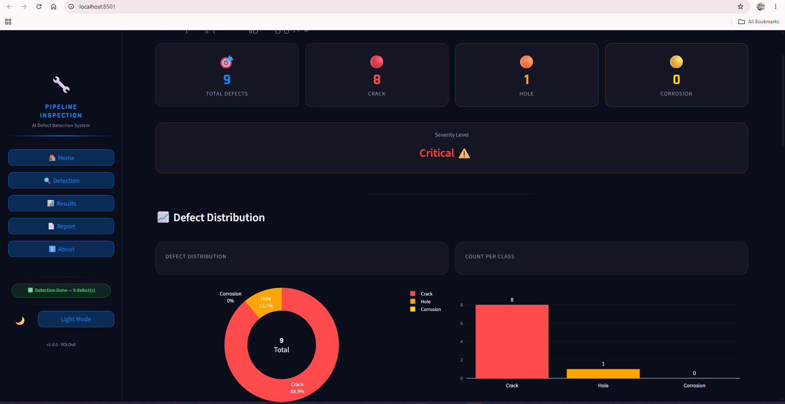
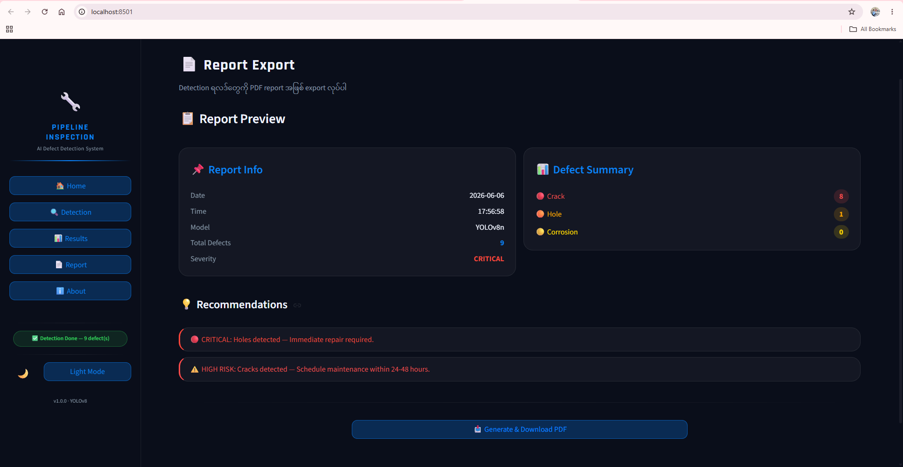
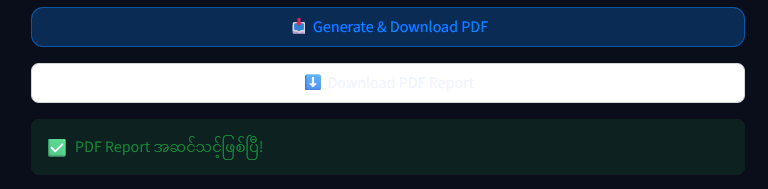

# 🛢️ Vision-Based Gas Pipeline Inspection Dashboard (Web Application)

## 📌 Project Overview

This repository contains the **Web Application & Dashboard** component of the "Vision-Based Crawler Robot for Gas Pipeline Inspection" project.

The application provides an interactive user interface built with **Streamlit** to automatically detect and classify defects inside gas pipelines using a custom-trained **YOLOv8m-P2** deep learning model. It allows users to upload pipeline images or video feeds, performs real-time inference, and generates downloadable **PDF Inspection Reports** detailing the severity and distribution of the detected faults.

> **Note:** This repository focuses strictly on the Software/Web UI and AI inference pipeline. The hardware integration (Raspberry Pi, Pi Camera, Crawler Robot) is maintained in a separate repository. [Link to Hardware Repo here - Optional]

## ✨ Key Features

- **Real-time Defect Detection:** Capable of processing both static images (`.jpg`, `.png`) and video feeds (`.mp4`, `.avi`, `.mov`).
- **Micro-Anomaly Detection:** Utilizes the modified `YOLOv8m-P2` architecture (Stride-4) specifically optimized for detecting extremely small objects (< 4x4 pixels) that standard models miss.
- **Multi-Class Classification:** Automatically classifies defects into three critical categories:
  - 🟥 **Crack**
  - 🟧 **Hole**
  - 🟨 **Heavy Corrosion**
- **Automated Reporting:** Generates a comprehensive summary including defect count, severity levels, and risk distribution, exportable as a downloadable **PDF Report**.

## Web UI

  

  

  

  

## 🧠 AI Model Architecture & Performance

We selected the **YOLOv8m-P2** model because it preserves high-resolution spatial maps in its early layers (P2 layer), making it ideal for hairline cracks and tiny corrosion spots.

- **Input Size:** 960x960 pixels
- **Confidence Threshold:** 0.45
- **IoU Threshold (NMS):** 0.45
- **Overall Accuracy:** 72.9%
- **F1-Scores:** Crack (73.1%), Hole (69.4%), Corrosion (76.0%)

## ⚙️ System Workflow

1. **Input Stage:** User uploads an image/video via the Streamlit dashboard.
2. **Preprocessing:** The system resizes the image or extracts video frames.
3. **Inference:** The YOLOv8m-P2 model runs defect detection.
4. **Post-Processing:** Bounding boxes are drawn, and confidence scores are calculated.
5. **Output & Report:** The dashboard displays the annotated media alongside a statistical summary (Count + Severity). The user can then export this data as a PDF.

## 🛠️ Tech Stack

- **Frontend/UI:** Streamlit
- **AI/Computer Vision:** Ultralytics (YOLOv8), OpenCV, PyTorch
- **Data Processing:** NumPy, Pandas
- **Report Generation:** FPDF / ReportLab (or standard Streamlit PDF generation)

## 🚀 Installation & Usage

### Prerequisites

Make sure you have Python 3.8+ installed.

### 1. Clone the Repository

bash
git clone [https://github.com/waiyanminlu11/vision-based-pipeline-inspection-using-YOLO.git]
cd vision-based-pipeline-inspection-using-YOLO

**Install Dependencies**

- pip install -r requirements.txt

**Run the Application**

- streamlit run app.py
